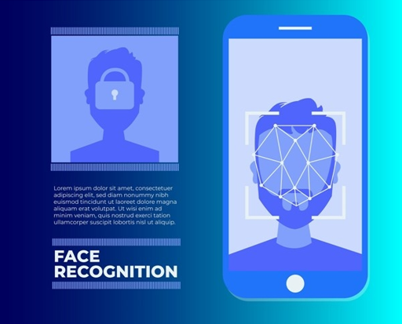
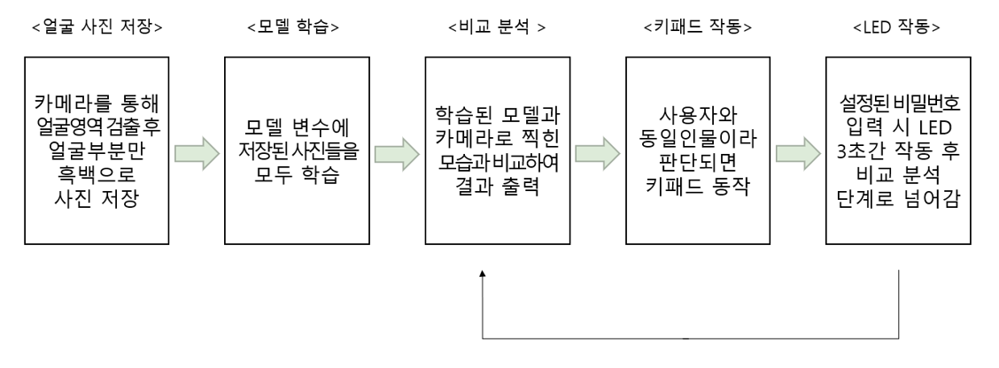
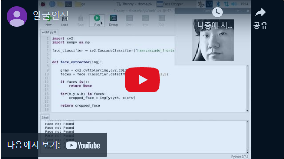

### 얼굴인식 도어락

- 교육시킨 얼굴이 맞다면 비밀번호를 입력할 수 있음
- 비밀번호가 맞다면 LED 켜짐

### 📚 사용 스택

**BackEnd :**

- OpenCV
- Linux
- Python

**Board** : 

- Raspberry Pi 4 B+

**Sensor :** 

- 라즈베리파이 카메라
- 멤브레인 키보드

**시스템 아키텍처**

### 📋 수행한 역할

수행한 역할 : **팀장 및 총괄**(`얼굴인식`, `얼굴교육`, `환경세팅`)

프로젝트에서 `60%` 정도의 기능 구현을 하였습니다.

- 라즈베리파이의 OS인 라즈비안 설치 및 OpenCV 사용환경 설치
- 센서 카메라 설치 동작 테스트
- OpenCV를 활용한 얼굴 사진 100장 찍기
- haarcascade를 통해 학습
- 교육된 객체와 실시간으로 찍힌 모습과 대조하여 유사도 판단

### 🎡 기능 소개

- 100장 찍고 교육시킨 후 유사도에 따라 텍스트 출력 및 LED 켜짐

### 🚀 배운점 & 보완점

**배운점**

1. 라즈베리파이 사용을 위한 세팅 설정 가능
2. OpenCV를 사용하기 위한 환경 세팅
3. haarcascade를 통해 학습하는 방법

**보완점**

- 100장을 찍어서 학습을 하여도 동일한 사람이 안경을 쓰거나 다른 각도를 보여지면 동일인이라고 판단하지 못하는 경우가 있었다. 더 많은 교육 자료를 제공하여 교육시킨다면 더욱 정확한 유사도를 통해 안정성을 높일 수 있다고 생각합니다.